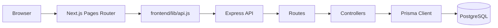
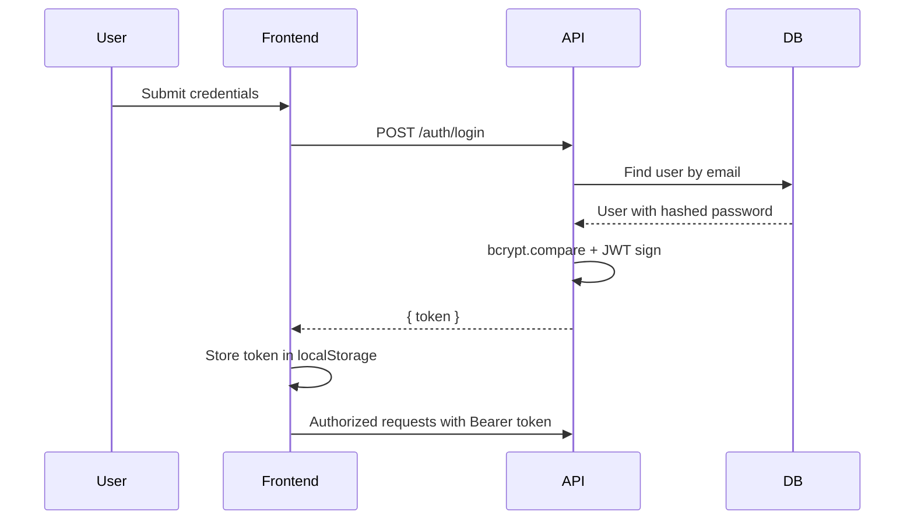
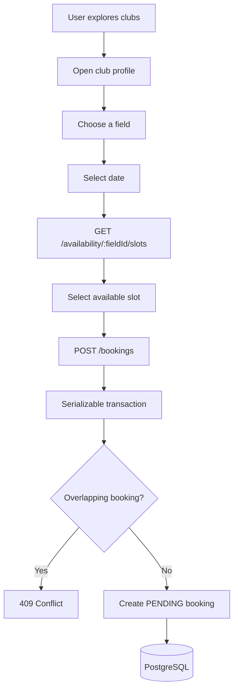

# Architecture

CanchealApp is a two-application full-stack system: a Next.js frontend and an Express API. The backend persists domain data through Prisma and PostgreSQL. The architecture is deliberately simple and easy to operate, which fits the current product scope while leaving room for future modules such as reviews, payments, notifications, and media.

## System Diagram



## Frontend Responsibilities

- Render public and authenticated product flows.
- Manage page routing with the Next.js Pages Router.
- Store JWTs in `localStorage` for authenticated API requests.
- Call the backend through `frontend/lib/api.js`.
- Provide responsive marketplace, booking, and owner interfaces.
- Present deterministic temporary ratings/reviews data until those fields are provided by the API.

## Backend Responsibilities

- Authenticate users through email/password credentials.
- Issue JWTs containing `id` and `role` claims.
- Authorize protected operations for users, owners, and admins.
- Validate request payloads.
- Read and write clubs, fields, availability, and bookings.
- Generate available booking slots from weekly availability rules.
- Prevent overlapping bookings with transactional checks.
- Expose a health check for deployment monitoring.

## Communication

The frontend uses `apiFetch(path, options)` from `frontend/lib/api.js`. The API base URL comes from `NEXT_PUBLIC_API_URL`. When omitted, requests use same-origin paths.

Authenticated requests include:

```http
Authorization: Bearer <jwt>
```

The backend CORS allowlist is configured through `FRONTEND_URL`, `FRONTEND_URLS`, and `CORS_ORIGINS`, with defaults for local development and the current Vercel production URL.

## Authentication



JWTs are signed with `JWT_SECRET` and expire after one day.

## Reservation Flow



## Owner Dashboard Flow

```mermaid
flowchart TD
  Owner[Owner/Admin] --> Dashboard[/owner/dashboard]
  Dashboard --> Mine[GET /clubs/mine]
  Dashboard --> CreateClub[POST /clubs]
  Dashboard --> ManageClub[/owner/club/:id]
  ManageClub --> CreateField[POST /fields]
  ManageClub --> LoadAvailability[GET /availability/:fieldId]
  ManageClub --> SaveAvailability[POST /availability]
```

## Marketplace Flow


## Data Flow

1. Pages load data through the API client.
2. The Express router maps requests to controllers.
3. Controllers validate inputs and authorization context.
4. Prisma executes queries and transactions.
5. Responses are JSON payloads consumed by React pages.

## Scalability Notes

- The current architecture is appropriate for a single-product MVP or portfolio-grade production app.
- Prisma model boundaries map cleanly to product concepts.
- Booking conflict detection already lives on the server and uses a serializable transaction.
- Future pressure points include media storage, payments, owner analytics, search ranking, and notification delivery.

## Known Limitations

- Reviews, ratings, favorites, payments, notifications, maps, and image galleries are not persisted yet.
- The frontend currently uses deterministic presentation data for ratings/reviews until backend fields exist.
- There is no workspace runner at the repository root; frontend and backend are separate Node projects.
