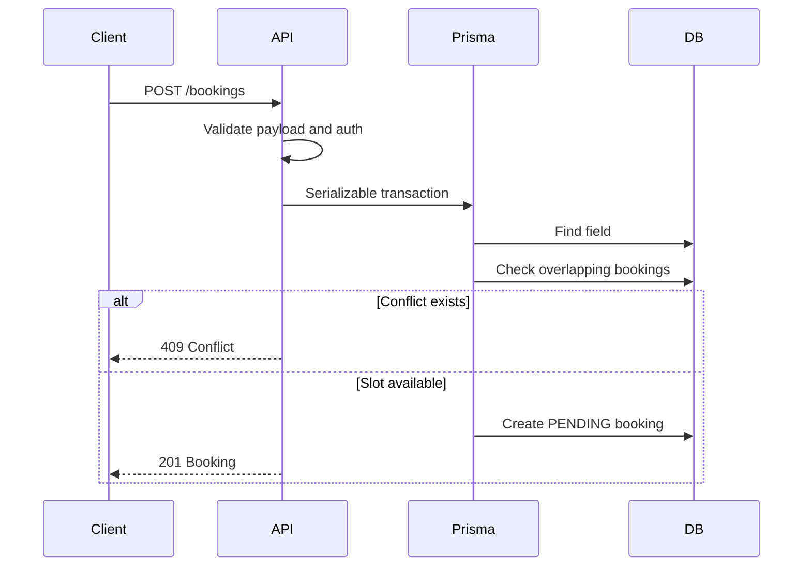

# Backend

The backend is an Express application with Prisma and PostgreSQL. It provides authentication, marketplace data, owner operations, availability management, and booking creation/cancellation.

## Entry Point

`backend/index.js` is responsible for:

- Loading environment variables.
- Validating `JWT_SECRET` on startup.
- Configuring CORS.
- Parsing JSON requests.
- Logging request timing and database timing metadata.
- Mounting route modules.
- Exposing `/health`.
- Starting the server on `PORT` or `4000`.

## Structure

```text
backend/
├─ index.js
├─ prisma/
│  ├─ schema.prisma
│  └─ seed.js
└─ src/
   ├─ controllers/
   ├─ lib/
   ├─ middlewares/
   ├─ routes/
   └─ utils/
```

## Routes and Controllers

Routes are thin and delegate business logic to controllers.

| Route Module | Base Path | Controller |
| --- | --- | --- |
| `authRoutes.js` | `/auth` | `authController.js` |
| `clubRoutes.js` | `/clubs` | `clubController.js` |
| `fieldRoutes.js` | `/fields` | `fieldController.js` |
| `availabilityRoutes.js` | `/availability` | `availabilityController.js` |
| `bookingRoutes.js` | `/bookings` | `bookingController.js` |

## Authentication

Authentication is JWT-based.

Login flow:

1. Normalize email.
2. Look up user by email.
3. Compare password with bcrypt.
4. Sign JWT with `{ id, role }`.
5. Return `{ token }`.

Protected routes use `authMiddleware`, which requires a Bearer token and sets `req.user` from the decoded JWT.

## Authorization

Authorization is handled per controller:

- Club creation requires `OWNER` or `ADMIN`.
- Public registration creates standard `USER` accounts; owner/admin accounts must be seeded or created through an administrative process outside the current public API.
- Field creation requires the authenticated user to own the target club.
- Availability updates require club ownership or `ADMIN`.
- Booking cancellation requires booking ownership or `ADMIN`.
- Booking status updates allow booking owners to cancel, and allow club owners/admins to perform permitted transitions.

## Booking Reliability

Booking creation validates:

- Positive `fieldId`.
- ISO 8601 `startAt` and `endAt`.
- `startAt < endAt`.
- Minimum duration of 60 minutes.
- Field existence.
- No overlapping non-cancelled bookings.

Conflict detection runs inside a Prisma transaction with serializable isolation.



## Availability

Availability is stored as weekly rules. Available slots are generated dynamically for a date by:

1. Loading matching weekday availability rules.
2. Loading non-cancelled bookings that overlap the target day.
3. Splitting availability ranges into slots.
4. Removing slots that overlap existing bookings.

## Prisma

`backend/src/lib/prisma.js` exports the shared Prisma client used by controllers and health checks.

Development commands:

```bash
cd backend
npx prisma validate
npx prisma migrate dev
npx prisma generate
```

## Error Handling

Controllers use explicit status responses for common validation/authorization failures and `sendError` for fallback Prisma/controller errors.

## Backend Validation

```bash
cd backend
npm test
npx prisma validate
```

## Known Limitations

- No refresh token flow.
- No centralized role middleware yet.
- No real automated endpoint test suite.
- No payment, notification, review, favorite, or media services yet.
