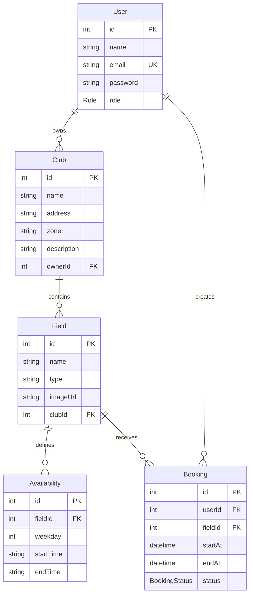

# Database

CanchealApp uses PostgreSQL through Prisma. The schema models users, clubs, fields, weekly availability rules, and bookings.

## Data Model Diagram

## Current Tables

### User

Stores account credentials and role information.

Fields:

- `id`: auto-incremented primary key.
- `name`: user display name.
- `email`: unique login identifier.
- `password`: bcrypt hash.
- `role`: `USER`, `OWNER`, or `ADMIN`.

Relations:

- Owns many clubs through `Club.ownerId`.
- Creates many bookings through `Booking.userId`.

### Club

Represents a football club or venue.

Fields:

- `id`: auto-incremented primary key.
- `name`: club name.
- `address`: physical address.
- `zone`: searchable/geographic zone.
- `description`: profile copy.
- `ownerId`: owner user foreign key.

Indexes:

- `ownerId` for owner dashboard lookups.
- `zone` for marketplace filtering.

### Field

Represents a bookable pitch inside a club.

Fields:

- `id`: auto-incremented primary key.
- `name`: field name.
- `type`: field type such as `5`, `7`, `8`, or `11`.
- `imageUrl`: optional field image URL.
- `clubId`: parent club foreign key.

Indexes:

- `clubId` for loading fields by club.

### Availability

Stores weekly recurring availability rules for a field.

Fields:

- `id`: auto-incremented primary key.
- `fieldId`: field foreign key.
- `weekday`: integer from `0` to `6`, where `0` is Sunday.
- `startTime`: `HH:mm` string.
- `endTime`: `HH:mm` string.

Indexes:

- `(fieldId, weekday)` for slot generation queries.

### Booking

Stores user reservations.

Fields:

- `id`: auto-incremented primary key.
- `userId`: booking owner foreign key.
- `fieldId`: reserved field foreign key.
- `startAt`: reservation start timestamp.
- `endAt`: reservation end timestamp.
- `status`: `PENDING`, `CONFIRMED`, or `CANCELLED`.

Indexes:

- `(fieldId, startAt, endAt)` for overlap checks.
- `(userId, startAt)` for user booking history.
- `status` for status-filtered queries.

## Current Enums

### Role

- `USER`: standard player account.
- `OWNER`: club owner account.
- `ADMIN`: administrative account.

### BookingStatus

- `PENDING`: default state for new bookings.
- `CONFIRMED`: accepted booking state.
- `CANCELLED`: soft-cancelled booking state.

## Future Tables

The current frontend already leaves space for richer marketplace data. These tables are not implemented yet, but they are natural extensions of the current model.

### Review

Potential purpose:

- Store user reviews for clubs and fields.
- Provide `ratingAverage`, `reviewsCount`, and `reviewPreview` from real backend data.

Likely relationships:

- `User` one-to-many `Review`.
- `Club` one-to-many `Review`.
- Optional `Field` one-to-many `Review`.

### Favorite

Potential purpose:

- Let users save clubs or fields for later.

Likely relationships:

- `User` one-to-many `Favorite`.
- `Club` or `Field` as target entities.

### ClubImage

Potential purpose:

- Support real gallery images in club profiles and marketplace cards.

Likely relationships:

- `Club` one-to-many `ClubImage`.

### Payment

Potential purpose:

- Connect bookings to payment state, provider references, refunds, and revenue reporting.

Likely relationships:

- `Booking` one-to-one or one-to-many `Payment`, depending on provider flow.

## Modeling Notes

- Availability is modeled as recurring weekly rules rather than individual available slots.
- Available slots are derived at request time from rules and existing bookings.
- Bookings are the durable reservation records.
- Booking creation includes overlap detection in a serializable transaction to reduce race conditions.
